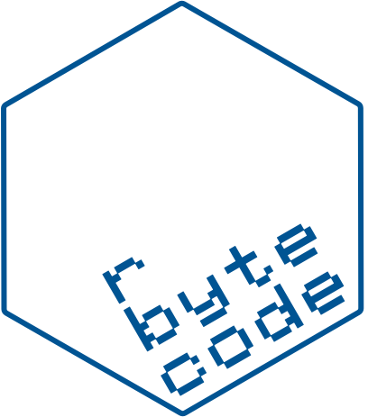

<!-- README.md is generated from README.Rmd. Please edit that file -->

```{r, include = FALSE}
knitr::opts_chunk$set(
  collapse = FALSE,
  comment = "",
  fig.path = "man/figures/README-",
  out.width = "100%"
)

library(rbytecode)
```

# rbytecode 

<!-- badges: start -->

<!-- badges: end -->

Modern R now executes most code in a stack-based virtual machine (VM).

The R code you write is first parsed to 
an abstract syntax tree, which is then compiled to bytecode,  and this 
bytecode is then executed in *R's bytecode VM*.

`{rbytecode}` provides an assembler and disassembler for R bytecode - allowing
you to peek under the hood at what R is doing to execute your code.

The disassembler is a way of inspecting R code internals by dissecting existing code.

The assembler is a way of compiling R *bytecode assembly* directly into a *bytecode object* i.e.
writing directly in the virtual machine language understood internally by 
R's bytecode VM.

This work is heavily based around the `{compiler}` package (built-in to R) and
Luke Tierney's document 
[A Byte Code Compiler for R](https://homepage.cs.uiowa.edu/~luke/R/compiler/compiler.pdf)

## This package has a book!

I have written a book to accompany this package.  The book gives some background on 
R's execution of code in its stack-based virtual machine and a reference for the
different bytecode instructions understood by this VM.

Available from:

* [LeanPub](https://leanpub.com/rbytecode) EPUB available for free - but 
  if you felt like showing support there is an option for a small payment.
* [Online html](https://coolbutuseless.github.io/book/rbytecodebook/)


# Ideas for the Future 

* Add support for `SWITCH` instruction
* Keep track of stack size during assembly to try and catch bad code.
* Write a small VM - maybe only covering a subset of instructions.

## What's in the box

* `dis()` disassembles R language objects to bytecode assembly
* `disq()` a helper function where `disq(1 + x)` is equivalent to `dis(quote(1 + x))`
* `asm()` an assembler for R bytecode.  Takes R bytecode assembly and outputs 
  an executable bytecode object


## Installation

You can install from [GitHub](https://github.com/coolbutuseless/rbytecode) with:

``` r
# install.package('remotes')
remotes::install_github('coolbutuseless/rbytecode')
```

## Disassembler


```{r example}
library(rbytecode)

disq(x + 1) |> 
  as.character()
```


```{r}
disq(function(x, y = 1) {x + y}) |> 
  as.character()
```


## Assembler - simple example

```{r}
#~~~~~~~~~~~~~~~~~~~~~~~~~~~~~~~~~~~~~~~~~~~~~~~~~~~~~~~~~~~~~~~~~~~~~~~~~~~~
# Create bytecode assembly
#~~~~~~~~~~~~~~~~~~~~~~~~~~~~~~~~~~~~~~~~~~~~~~~~~~~~~~~~~~~~~~~~~~~~~~~~~~~~
code <- r"(
LDCONST 1
LDCONST 2
ADD
RETURN
)"

#~~~~~~~~~~~~~~~~~~~~~~~~~~~~~~~~~~~~~~~~~~~~~~~~~~~~~~~~~~~~~~~~~~~~~~~~~~~~
# Assemble the code into a bytecode object
#~~~~~~~~~~~~~~~~~~~~~~~~~~~~~~~~~~~~~~~~~~~~~~~~~~~~~~~~~~~~~~~~~~~~~~~~~~~~
bc <- asm(code)
bc

#~~~~~~~~~~~~~~~~~~~~~~~~~~~~~~~~~~~~~~~~~~~~~~~~~~~~~~~~~~~~~~~~~~~~~~~~~~~~
# Evaluate the bytecode
#~~~~~~~~~~~~~~~~~~~~~~~~~~~~~~~~~~~~~~~~~~~~~~~~~~~~~~~~~~~~~~~~~~~~~~~~~~~~
eval(bc)
```


## Bytecode Assembly - Fibonacci

The following bytecode assembly is a reimplementation of R code for calculating
the 11th Fibonacci number.

```{r}
#~~~~~~~~~~~~~~~~~~~~~~~~~~~~~~~~~~~~~~~~~~~~~~~~~~~~~~~~~~~~~~~~~~~~~~~~~~~~
# R implementation
#~~~~~~~~~~~~~~~~~~~~~~~~~~~~~~~~~~~~~~~~~~~~~~~~~~~~~~~~~~~~~~~~~~~~~~~~~~~~
i   <- 0
fn2 <- 0
fn1 <- 1
while (i < 10) {
  fnnew <- fn1 + fn2
  fn2   <- fn1
  fn1   <- fnnew
  i     <- i + 1
}
fn1
```


```{r}
#~~~~~~~~~~~~~~~~~~~~~~~~~~~~~~~~~~~~~~~~~~~~~~~~~~~~~~~~~~~~~~~~~~~~~~~~~~~~
# Bytecode implementation
#~~~~~~~~~~~~~~~~~~~~~~~~~~~~~~~~~~~~~~~~~~~~~~~~~~~~~~~~~~~~~~~~~~~~~~~~~~~~
code <- r"(
LDCONST 0L
SETVAR i
SETVAR fn2
LDCONST 1L
SETVAR fn1
@start 
GETVAR i
LDCONST 10L
LT 
BRIFNOT @end
GETVAR fn1
GETVAR fn2
ADD 
SETVAR fnnew
POP 
GETVAR fn1
SETVAR fn2
POP 
GETVAR fnnew
SETVAR fn1
POP 
GETVAR i
LDCONST 1L
ADD 
SETVAR i
POP 
GOTO @start
@end 
GETVAR fn1
RETURN 
)"

asm(code) |> eval()
```


## Related Software

* The `{compiler}` package. One of the base R packages.

## Acknowledgements

* R Core for developing and maintaining the language.
* CRAN maintainers, for patiently shepherding packages onto CRAN and maintaining
  the repository
